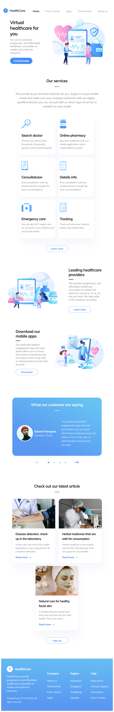

# Описание проекта


  

&NewLine;

&NewLine;

Данная работа была выполнена в рамках прохождения курса «Профессиональная разработка мобильных приложений» от компании Effective с целью получения первичных навыков в работе с ```Java Script``` библиотекой __React__.

Средствами представленной технологии необходимо было реализовать макет, доступный по ссылке: https://www.figma.com/file/4HxKAipeUl0XV4poXyxvnv/Effective-Web-Course?node-id=58%3A273&mode=dev

&NewLine;
В результате работы с помощью библиотеки __React__ был спроектирован сайт, поддерживаемый разрешения экрана от стандартного десктопного до мобильного:
&NewLine;

```Используемая версия NodeJS - 20.10.0```

```Используемая версия npm - 10.2.5```

## Десктопный вариант (1500px)


## Планшентный вариант (768px)


## Мобильный вариант (iPhone SE, 375px)

